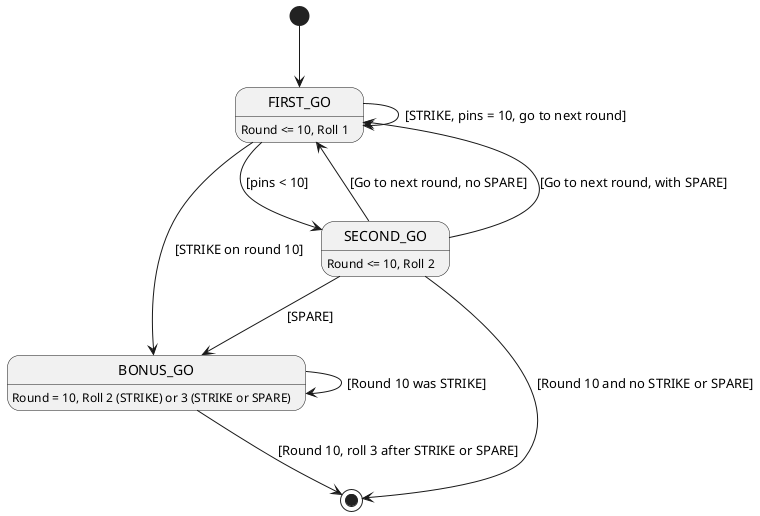

# Bowling
Bowling scoring coding project. Similar problem as in [https://github.com/prem-muthedath/bowling](https://github.com/prem-muthedath/bowling)

```plantuml
@startuml
[*] --> FIRST_GO
FIRST_GO : Round <= 10, Roll 1
FIRST_GO --> SECOND_GO : [pins < 10]
FIRST_GO --> FIRST_GO : [STRIKE, pins = 10, go to next round]
 
SECOND_GO : Round <= 10, Roll 2
SECOND_GO  --> FIRST_GO : [Go to next round, no SPARE]
SECOND_GO  --> FIRST_GO : [Go to next round, with SPARE]
SECOND_GO--> [*] : [Round 10 and no STRIKE or SPARE]
SECOND_GO --> BONUS_GO : [SPARE]
 
BONUS_GO : Round = 10, Roll 2 (STRIKE) or 3 (STRIKE or SPARE)
FIRST_GO  -> BONUS_GO : [STRIKE on round 10]
BONUS_GO  --> BONUS_GO : [Round 10 was STRIKE]
BONUS_GO  --> [*] : [Round 10, roll 3 after STRIKE or SPARE]

@enduml
```
