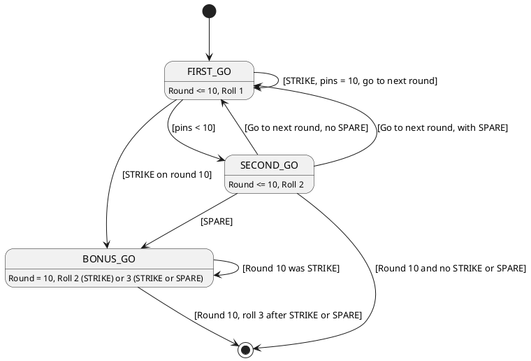
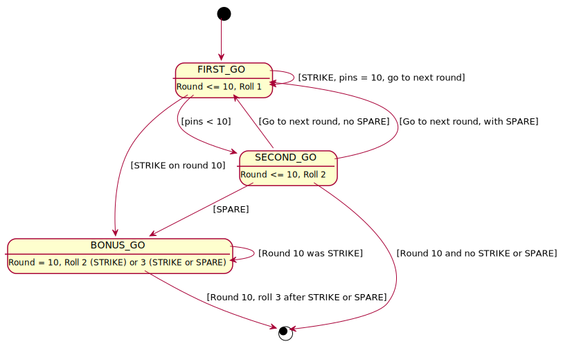

# Bowling
Bowling scoring algorithm coding project (often given as an XP pairing and/or interview tests). Similar problem as in [https://github.com/prem-muthedath/bowling](https://github.com/prem-muthedath/bowling)

Given a bowling interface, implement a bowling scoring algorithm.

```java
public interface Bowling {

  // called each time the player rolls a ball. The argument is the number of pins
  // knocked down
  void roll(int noOfPins);

  int score(); // returns the total score of the game
}
```

### To run the tests: 

```
mvn clean test
```

## Proposed solution approach (timings given are a personal view):

* Analysis and modelling
* Implementation
* Technical Debt Resolution and Code Optimisation

## Problem analysis and domain modelling (60 minutes)

While the game of bowling is familiar to many, coding the scoring algorithm requires some domain modelling choices. There is no unique way to do this and some alternative models could be played against each other at the initial phase perhaps accompanied by some fast model prototyping or whiteboarding and scratch padding. For example, do we model each frame (e.g., round) and each roll (e.g., a turn or a go) as domain objects or do we flatten the model to a single game state encompassing all that is required to uniquely define a state in point of time.

After consideration of the above two approaches it was decided to go with the latter approach and have a flat bowling game state model because it could result in more concise code base:

```java
public class GameState {
	private int score = 0;
	private int nextFrame = 1;
	private int nextRoll = 1;
	private boolean spareBonus = false;
	private int strikeBonus = 0;
	private int prevRollValue = 0;
}
```

Score is to hold the accumulative score so far, next frame and next roll are references that uniquely define where in the game sequence will the next move be at, spare bonus and strike bonus are flags that contain information about any bonus rules to be applied and the previous roll value (e.g., number of pins scored during previous go) is used to determine if we have a two rolls SPARE (for example 3 pins in go one and 7 pins in go two).

## Implementation (60-90 minutes)

A decision has been taken to keep the game state model declarative (which always improves readability) and keep the code separate in a helper class. The actual helper pattern used ended up being inheritance (an abstract parent class `GameStateHelper.java`) rather than an interface with default methods mainly due to state model data access encapsulation. The game state model setters are set to `@Setter(AccessLevel.PROTECTED)` while to maintain observability the getters are left public.

Initial implementation of the game state helper class included imperative logic closely following the textual description of the bowling scoring rules similar to the ones found here: 
[Bowling scoring rules description](https://www.topendsports.com/sport/tenpin/scoring.htm). The task description didn't include any information about the score output representation (e.g., no "X" and "/" were described as required).

At this stage tests were written to capture a comprehensive set of game scenarios including ending the game with STRIKE and SPARE. The observability of the game state model allows for a strict set of assertions while not having to rely on mocking. 

## Technical Debt Resolution and Code Optimisation (60-90 minutes)

The textual algorithm description and the literal code implementation in the previous step doesn't provide a good visualisation of the state machine and time sequence. Extracting the logic into a state machine pattern would greatly improve readability and maintainability of the code. To achieve that first we need to explicitly define the state machine model which our implementation follows. Below is the PlantUML of a state machine for our algorithm. Note how we have decided to map reduce our game state into only three discrete machine states.  




There were no non-functional specifications in the task description so no code optimisation was considered. The implementation is not thread safe and marked accordingly.

## Conclusions

Some people might say why not avoid any technical debt and resolve it all in one go at the implementation phase. The reason is that more often than not while going through the motions of implementing a specific design some Eureka moments can lead to ideas to improve it. The more complex the subject matter the more opportunities for improvements and optimisation might present themselves. Denying the chance to continuously improve the design and implementation by registering and resolving the technical debt, it can easily accumulate and lead to "code explosion" and lack of maintainability.

Others might ask why do we need rapid prototyping in phase one? While the rapid prototyping is a personal choice, "war gaming" various modelling approaches quite often is the most significant factor that pre-determines the complexity of the implementation. Rapid prototyping is a tool to gain a glimpse of the ensuing code complexity given certain design decisions.

When is the right moment to write the tests? There are those who insist to write test first and do coding later in a single phase, however, in practice this is only possible for well defined small tasks with little or no element of creativity. The right moment to write the tests in the above three phase approach is the second phase. If we write the tests too early (phase one) we will hamper the rapid prototyping as it will invariably involve refactoring the tests while switching from one model to another. In this phase one way to interact with the model could be via some sort of interactive shell (like spring boot shell). If we do the test too late (e.g., phase three) we risk introducing regression bugs especially as the last phase involves some form of refractoring. 